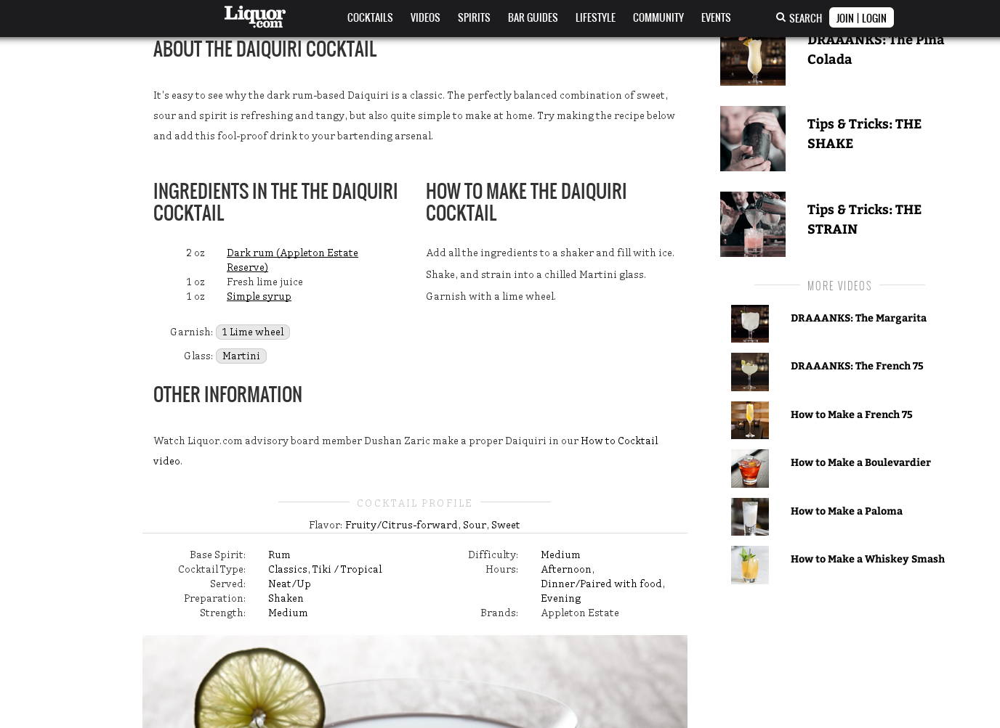
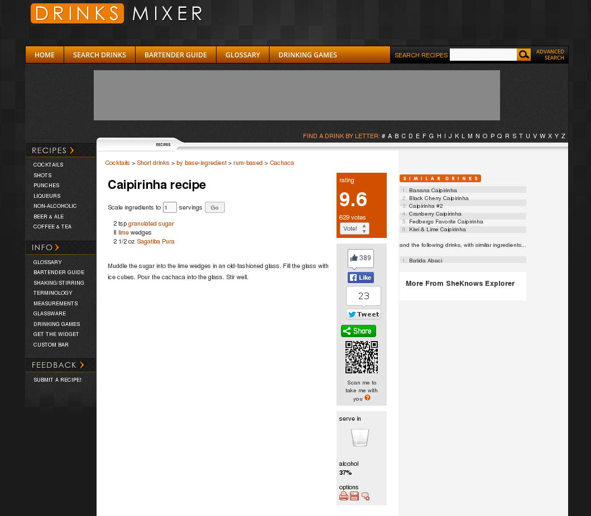
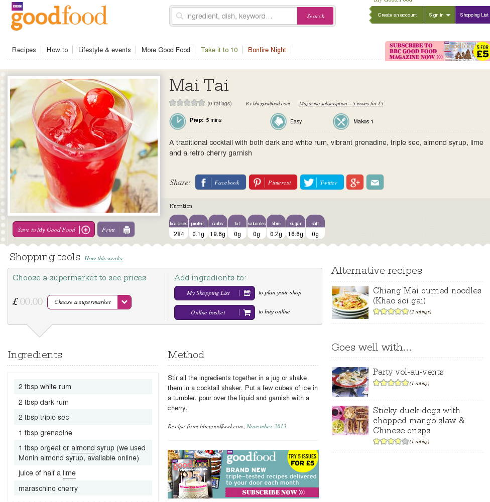
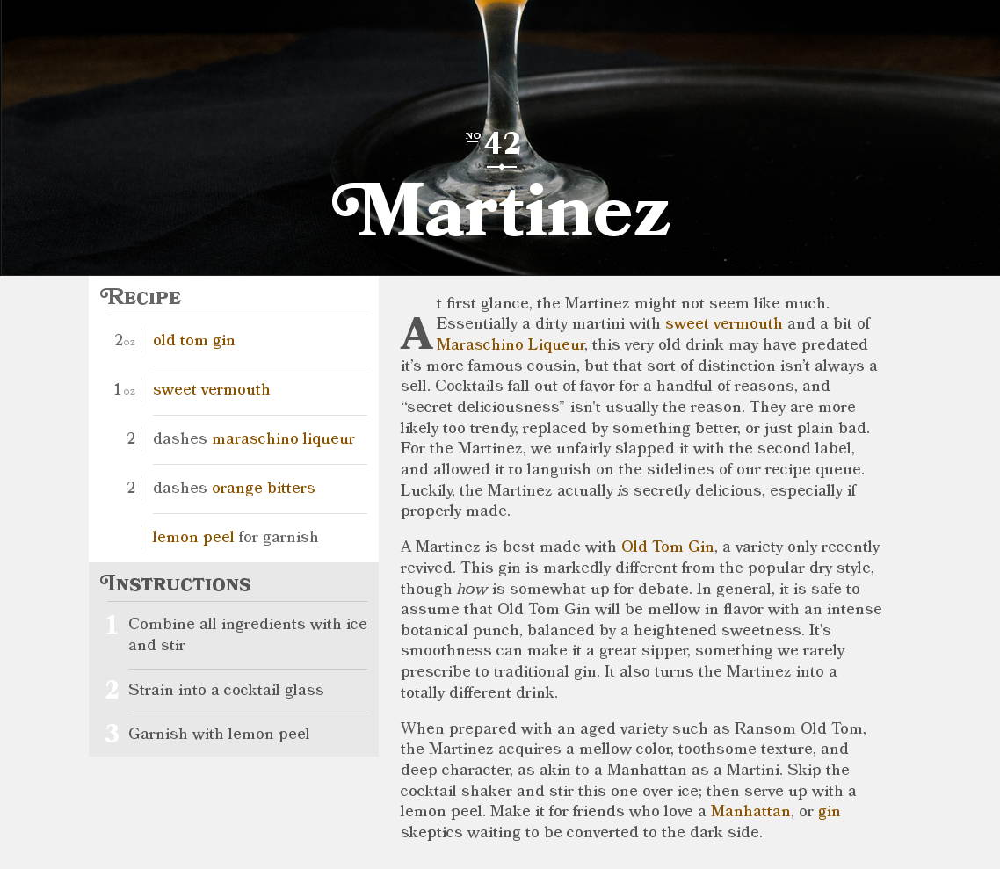
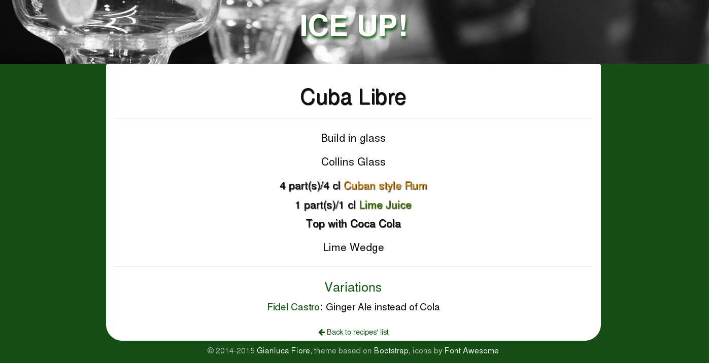

Ice-Up
======

What's this?
============

A collection of the most common/widespread cocktails recipes in a quick to look up, textual, no fuss format. It is built as an AngularJS app making use of the Bootstrap framework.

What's this for?
================

Bartenders. If you don't know the difference between "shake hard" and just "shake" or have to look up the meaning of "fine straining", this is not for you.

Why?
====

There are many websites listing cocktail recipes. A few specialized ones, many generic that collect cooking recipes and have a section for cocktails. So why yet another one? Why repeating the same informations that can be found elsewhere?

Because all those websites suffer from a few problems. Let me show you.

A simple recipe, the Daiquiri. Rum + Lime juice + Sugar syrup. Martini glass, single garnish. Nothing fancy, it's a basic cocktail. Yet here we see a whole bunch of unnecessary information.

* We are informed that we should be using Appleton Estate Reserve Rum. Thanks, I will choose the Rum myself.
* Lime juice should be fresh. Of course it should, it's obvious for a bartender. If you don't know why, you suck at bartending.
* There's a list of flavours, which should immediately coming to mind of a professional bartender just by reading the list of ingredients. I don't need them listed.
* There's a list of categories this cocktail purportedly falls into (_tropical_, _strength_, _difficulty_, _hours_ etc.). Nobody that is a professional needs all this. Besides, how is the Daiquiri of a "medium" difficulty?
* Picture of the drink. No thanks, just tell me "Martini Glass, Dark Rum, Lime juice and Syrup" and I will instantly know that the final drink will be yellowish. I will provide with the style of garnish that I like too, no need to show me how you prefer.
* A video, above the recipe, of the preparation. Seriously. In the time that it takes to watch it I can make a couple of Daiquiris.
* Various links to methods, recipes and, God forbid, more videos on the sidebar. I just need to know how to make a Daiquiri, what's with the Boulevardier recipe?

A lot of unnecessary text and media that distract you from what really matters: ingredients, glass, garnish and preparation. That's it.

Better. No fancy images and videos, the central element is the actual recipe, as it should be. Yet...

* Cachaça suggested is Sagatiba Pura. What if I prefer Ypioca? Don't push me into choosing one brand over another...
* There's a useful scaling to more servings but quantities are only in oz. Why not giving the recipes in more flexible *parts*? Or using also *cl*, for us europeans?
* Alcohol content is given which is useless, as it depends on too many factors to be reliable.
* Rating? Who gave it? On what basis? Again, useless information.

Better looking but again, a lot of unnecessary content

* Shopping list, online basket, find a supermarket...I just need to make a Mai Tai.
* Calories. If you care about your body shape you should stick to virgin cocktails. Or coffee.
* Preparation time, rating, difficulty. It's all relative, it doesn't make any sense to specify those things.
* Tbsp. And "juice of half a lime". Tablespoons are not flexible, and not all spoons are made equal. Same thing for the limes, not all have the same size, the same amount of juice etc. Give me parts and/or precise measures please.

Beautiful. Stylish. If only wasn't for...

* Most of the page is a description of the cocktail. Useful, ok, but if I wanted to learn I'd buy a book, I need only the recipe now.
* No parts, just oz. Again.
* Picture. Increasing loading times for no reasons.

Did you see the pattern? All those websites list maybe hundreds or even thousands of recipes for the most rare and unheard of cocktails yet they fail all in the same ways: by adding too much content, by not being flexible and by trying to convince you that the way they make that specific cocktail is the one you should follow. A real bartender don't need any of that, simply a schematic listing of the ingredients, the garnish, the glass, the method and, eventually, the official variations of a cocktail. He/she will figure out the rest according to personal tastes, rules of the bar and his/her own fantasy.

This is where ICE UP! comes in.

Here you have all the informations you need, and just those:

* Build in glass. Method
* Collins glass. What glass to use.
* List of ingredients with parts *and* cl. With different colours to instantly recognize what you need to use. No brands, unless the cocktail is officially made with a specific brand.
* Lime wedge. You know it's the garnish.
* Variations. No separate page for a cocktail that is identical but for 1 ingredient.
* No pictures, no videos, no share links or any other unrelated informations. You have the recipe, you have it in textual format so it loads very quickly and quantities are flexible. Only what is necessary, not a dot more.

Why "Ice Up!"?
==============

One of my bartending mentors when teaching me how to make cocktails always finished his instructions, where appropriate, with "Ice up and shake!". The phrase sticked in my mind. Shake isn't for every cocktails but ice 99% of the time is, and without shake is also shorter and more catchy, so I chose it as the name.

Where is it then?
=================

[See it, and use it, here](http://www.iceup.eu)

Gianluca Fiore, © 2014-2015, all rights reserved.
